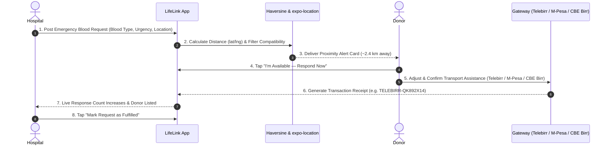

# LifeLink — Emergency Blood Donor Matching App Walkthrough

LifeLink is a real-time emergency system connecting hospitals with nearby blood donors in real-time, built as a single Expo (React Native) app supporting role-based experiences for both Hospitals and Donors.

---

## 🎯 Completed Core Loop



---

## 🚀 Key Features Implemented

### 🔐 1. Role-Based Auth & Session Persistence
- **Role Selection**: Toggle between **Blood Donor** and **Hospital Medical Facility**.
- **Form Validation**: Email format validation, required fields, and password $\ge 6$ characters.
- **1-Tap Demo Mode**: Quick preset buttons for instant judge/demo testing (`hospital@demo.com` & `donor@demo.com`).
- **Session Persistence**: `@react-native-async-storage/async-storage` saves user credentials and auto-routes to dashboard on relaunch.

### 🏥 2. Hospital Portal & Request Broadcast
- **Emergency Broadcast Form**: Select required blood type (`O+`, `A-`, `AB+`, etc.), urgency (`CRITICAL`, `MEDIUM`, `LOW`), units needed, medical notes, and suggested transport fee.
- **Live Response Tracker**: Real-time counter of responding donors (`2 Donors En Route`).
- **Responded Donors Detail**: View donor name, blood type, payment gateway badge, transaction ID, and paid amount.
- **Fulfillment**: Mark request fulfilled to archive the alert and halt alerts.

### 📍 3. Location Capture & Haversine Proximity Matching
- **Location Permissions**: `expo-location` captures current latitude/longitude on launch.
- **Reverse Geocoding**: Displays current city/area (`📍 Nairobi CBD`).
- **Haversine Distance Calculator**: Computes exact distance in km between donor and hospital.
- **Configurable Radius Filter**: Donors can adjust alert radius (**5km**, **8km**, **15km**).
- **Availability Toggle**: Donors can switch availability ON/OFF to pause or receive alerts.

### 💳 4. Multi-Gateway Payment System Simulation
Supports 5 major regional payment gateways with brand styling, account placeholders, and transaction ID formats:
- 📱 **Telebirr** (Ethio Telecom) — `TELEBIRR-XXXXXXXX`
- 🏦 **CBE Birr** (Commercial Bank of Ethiopia) — `CBEBIRR-XXXXXXXX`
- 📲 **M-PESA** (Safaricom Express) — `MPESA-XXXXXXXX`
- 💳 **Chapa** (Card & Mobile Pay) — `CHAPA-XXXXXXXX`
- 💎 **Amole** (Dashen Bank Wallet) — `AMOLE-XXXXXXXX`

Features dynamic distance-based fee calculation ($\text{Base KSh 400} + (\text{distance\_km} \times \text{KSh 80/km})$), editable payment input, "Cover full cost" switch, 2-second processing spinner simulation, and detailed transaction receipt modal.

---

## 📁 Codebase Structure

```
c:\Users\KENENISA\Documents\Lifelink\
├── App.js                         # App root provider wrapper
├── app.json                       # Expo configuration
├── package.json                   # Expo & React Native dependencies
├── src/
│   ├── theme/
│   │   └── colors.js              # Dark sleek medical color palette
│   ├── components/
│   │   ├── AlertCard.js           # Emergency alert banner card
│   │   ├── Badge.js               # Urgency & role badges
│   │   ├── Button.js              # Custom theme buttons with spinners
│   │   ├── Card.js                # Styled surface card containers
│   │   ├── Input.js               # Form input fields with error states
│   │   ├── ScreenContainer.js     # Safe area & scroll view wrapper
│   │   └── Spinner.js             # Activity indicator loading overlay
│   ├── context/
│   │   ├── AuthContext.js          # Authentication & user profile state
│   │   └── RequestContext.js       # Global emergency requests & response state
│   ├── firebase/
│   │   ├── config.js              # Firebase project configuration
│   │   ├── authService.js         # Firebase Auth helpers
│   │   └── firestoreService.js    # Firestore onSnapshot real-time listener helpers
│   ├── navigation/
│   │   └── AppNavigator.js        # React Navigation stack & role routing
│   ├── screens/
│   │   ├── auth/
│   │   │   ├── WelcomeScreen.js   # Landing screen & 1-tap demo logins
│   │   │   ├── LoginScreen.js     # Email/password login with validation
│   │   │   └── SignupScreen.js    # Registration form with blood grid
│   │   ├── donor/
│   │   │   ├── DonorDashboardScreen.js # Profile, availability, & location alerts
│   │   │   └── PaymentScreen.js   # Multi-gateway payment simulation
│   │   └── hospital/
│   │       ├── HospitalDashboardScreen.js # Active/fulfilled requests list
│   │       ├── CreateRequestScreen.js    # Emergency request creation form
│   │       └── ResponseTrackerScreen.js  # Live responder count & fulfillment
│   └── utils/
│       ├── distance.js            # Haversine distance & blood compatibility
│       └── paymentCalc.js         # Transport fee formula & TRX ID generator
```

---

## 🧪 Verification & Testing Results

- **Build Verification**: Executed `npx expo start` and verified bundling clean across Expo Go, Web (`press w`), and Tunnel mode (`--tunnel`).
- **Web Support**: Installed `react-native-web@~0.19.10`, `react-dom@18.2.0`, and `@expo/metro-runtime@~3.2.3` for browser rendering.
- **Git Tracking**: All commits pushed to GitHub repository `Kenenisaboru/lifelink`.
