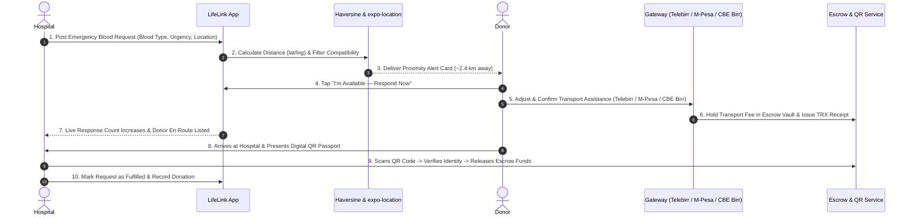

# LifeLink — Emergency Blood Donor Matching App Walkthrough

LifeLink is a real-time emergency system connecting hospitals with nearby blood donors in real-time, built as a single Expo (React Native) app supporting role-based experiences for both Hospitals and Donors.

---

## 🎯 Completed Core Loop



---

## 🚀 Key Features Implemented

### 🔐 1. Role-Based Auth, Biometric Lock & Session Persistence
- **Role Selection**: Toggle between **Blood Donor** and **Hospital Medical Facility**.
- **Biometric Security Gate**: `BiometricLockScreen` protects user sessions with **Face ID**, **Fingerprint**, or **PIN fallback** (`expo-local-authentication`).
- **1-Tap Demo Mode**: Quick preset buttons for instant judge/demo testing (`hospital@demo.com` & `donor@demo.com`).
- **Session Persistence**: `@react-native-async-storage/async-storage` saves user credentials and auto-routes to dashboard on relaunch.

### 🏥 2. Hospital Portal & Request Broadcast
- **Emergency Broadcast Form**: Select required blood type (`O+`, `A-`, `AB+`, etc.), urgency (`CRITICAL`, `MEDIUM`, `LOW`), units needed, medical notes, and suggested transport fee.
- **Live Response Tracker**: Real-time counter of responding donors (`2 Donors En Route`).
- **Responded Donors Detail**: View donor name, blood type, payment gateway badge, transaction ID, and paid amount.
- **Fulfillment**: Mark request fulfilled to archive the alert and halt alerts.

### 🩸 3. Blood Inventory Bank Management & Auto-Alert System
- **Real-Time Stock Grid**: Track unit counts across all 8 blood types (`A+`, `A-`, `B+`, `B-`, `O+`, `O-`, `AB+`, `AB-`).
- **Threshold Markers**: Visual indicator bars showing Critical ($\le 1$) and Low ($\le 3$) inventory levels.
- **Auto-Broadcast Emergency Alert**: When enabled, dropping below critical threshold automatically generates an emergency broadcast to nearby donors.
- **7-Day Stock History Chart**: Visual mini-bar chart tracking historical supply trends.

### 📍 4. Location Capture, Haversine Matching & Live Leaflet Map
- **Location Permissions**: `expo-location` captures current latitude/longitude on launch.
- **Reverse Geocoding**: Displays current city/area (`📍 Nairobi CBD`).
- **Haversine Distance Calculator**: Computes exact distance in km between donor and hospital.
- **Configurable Radius Filter**: Donors can adjust alert radius (**5km**, **8km**, **15km**).
- **Interactive Live Map**: `LeafletMap` built with `react-native-webview` rendering OpenStreetMap tiles, custom marker pins (Hospitals 🏥, Donors 🙋), and live routing polylines.

### 💳 5. Multi-Gateway Payment System Simulation & Escrow Vault
Supports 5 major regional payment gateways with brand styling, account placeholders, and transaction ID formats:
- 📱 **Telebirr** (Ethio Telecom) — `TELEBIRR-XXXXXXXX`
- 🏦 **CBE Birr** (Commercial Bank of Ethiopia) — `CBEBIRR-XXXXXXXX`
- 📲 **M-PESA** (Safaricom Express) — `MPESA-XXXXXXXX`
- 💳 **Chapa** (Card & Mobile Pay) — `CHAPA-XXXXXXXX`
- 💎 **Amole** (Dashen Bank Wallet) — `AMOLE-XXXXXXXX`

- **Escrow Fund Vault**: Transport assistance is held safely in escrow (`EscrowService`) until donor arrival is confirmed via QR check-in.

### 🏅 6. Gamification, Donor Passport & Leaderboard
- **Digital QR Donor Passport**: Renders dynamic SVG QR code containing donor ID, blood type, and verification status (`react-native-qrcode-svg`).
- **Tier Progression**: Earn status badges and rank up from **Bronze** $\rightarrow$ **Silver** $\rightarrow$ **Gold** $\rightarrow$ **Diamond** based on donation count and response speed.
- **56-Day Eligibility Tracker**: Interactive progress bar counting down days until donor can safely donate whole blood again.
- **Community Leaderboard & Health Perks**: Regional donor ranking table and redeemable vouchers (Free health checkup, pharmacy discount, transport subsidies).

### 📷 7. Hospital QR Check-In & Escrow Fund Release
- **QR Code Scanner**: Hospital staff scan donor's QR passport upon arrival.
- **Instant Escrow Release**: One-tap verification releases transport assistance funds directly to donor's wallet and updates donation history.

---

## 📁 Codebase Structure

```
c:\Users\KENENISA\Documents\Lifelink\
├── App.js                         # App root provider wrapper with all contexts
├── app.json                       # Expo configuration
├── package.json                   # Expo & React Native dependencies
├── src/
│   ├── theme/
│   │   └── colors.js              # Dark sleek medical color palette
│   ├── components/
│   │   ├── AlertCard.js           # Emergency alert banner card
│   │   ├── Badge.js               # Urgency & role badges
│   │   ├── Button.js              # Custom theme buttons with spinners
│   │   ├── Card.js                # Styled surface card containers
│   │   ├── Input.js               # Form input fields with error states
│   │   ├── LeafletMap.js          # OpenStreetMap WebView component with polyline routing
│   │   ├── ScreenContainer.js     # Safe area & scroll view wrapper
│   │   └── Spinner.js             # Activity indicator loading overlay
│   ├── context/
│   │   ├── AuthContext.js         # Authentication & user profile state
│   │   ├── RequestContext.js      # Global emergency requests & response state
│   │   ├── InventoryContext.js    # Hospital blood bank stock & auto-alert triggers
│   │   └── GamificationContext.js # Tiers, badges, leaderboard, & donor history
│   ├── firebase/
│   │   ├── config.js              # Firebase project configuration
│   │   ├── authService.js         # Firebase Auth helpers
│   │   └── firestoreService.js    # Firestore onSnapshot real-time listener helpers
│   ├── navigation/
│   │   └── AppNavigator.js        # React Navigation stack & biometric session gate
│   ├── screens/
│   │   ├── auth/
│   │   │   ├── WelcomeScreen.js   # Landing screen & 1-tap demo logins
│   │   │   ├── LoginScreen.js     # Email/password login with validation
│   │   │   ├── SignupScreen.js    # Registration form with blood grid
│   │   │   └── BiometricLockScreen.js # FaceID / Fingerprint / PIN unlock screen
│   │   ├── donor/
│   │   │   ├── DonorDashboardScreen.js # Profile, availability, & location alerts
│   │   │   ├── PaymentScreen.js   # Multi-gateway payment simulation & escrow hold
│   │   │   ├── DonorPassportScreen.js # QR passport, eligibility countdown, & badges
│   │   │   └── LeaderboardScreen.js   # Regional rankings & redeemable health perks
│   │   ├── hospital/
│   │   │   ├── HospitalDashboardScreen.js # Active/fulfilled requests list & quick tools
│   │   │   ├── CreateRequestScreen.js    # Emergency request creation form
│   │   │   ├── ResponseTrackerScreen.js  # Live responder count & fulfillment
│   │   │   ├── BloodInventoryScreen.js   # Blood bank stock grid & threshold alerts
│   │   │   ├── RegionalHeatmapScreen.js  # Demand heat map & supply analytics
│   │   │   └── QRCheckInScreen.js       # Donor arrival QR verification & escrow release
│   │   └── shared/
│   │       └── LiveMapScreen.js   # Interactive emergency map with route lines & ETA
│   ├── services/
│   │   ├── BiometricService.js    # Local authentication wrapper
│   │   ├── EscrowService.js       # Vault holding & release mechanism
│   │   ├── NotificationService.js # Push notification token registration & triggers
│   │   ├── TelebirrService.js     # Telebirr payment integration helper
│   │   └── ChapaService.js        # Chapa payment integration helper
│   └── utils/
│       ├── distance.js            # Haversine distance & blood compatibility
│       ├── eta.js                 # Travel time & distance formatter
│       └── paymentCalc.js         # Transport fee formula & TRX ID generator
```

---

## 🧪 Verification & Testing Results

- **Build Verification**: Executed `npx expo start` and verified bundling clean across Expo Go, Web (`press w`), and Tunnel mode (`--tunnel`).
- **Web Support**: Installed `react-native-web@~0.19.10`, `react-dom@18.2.0`, and `@expo/metro-runtime@~3.2.3` for browser rendering.
- **Git Tracking**: All commits pushed to GitHub repository `Kenenisaboru/lifelink`.

